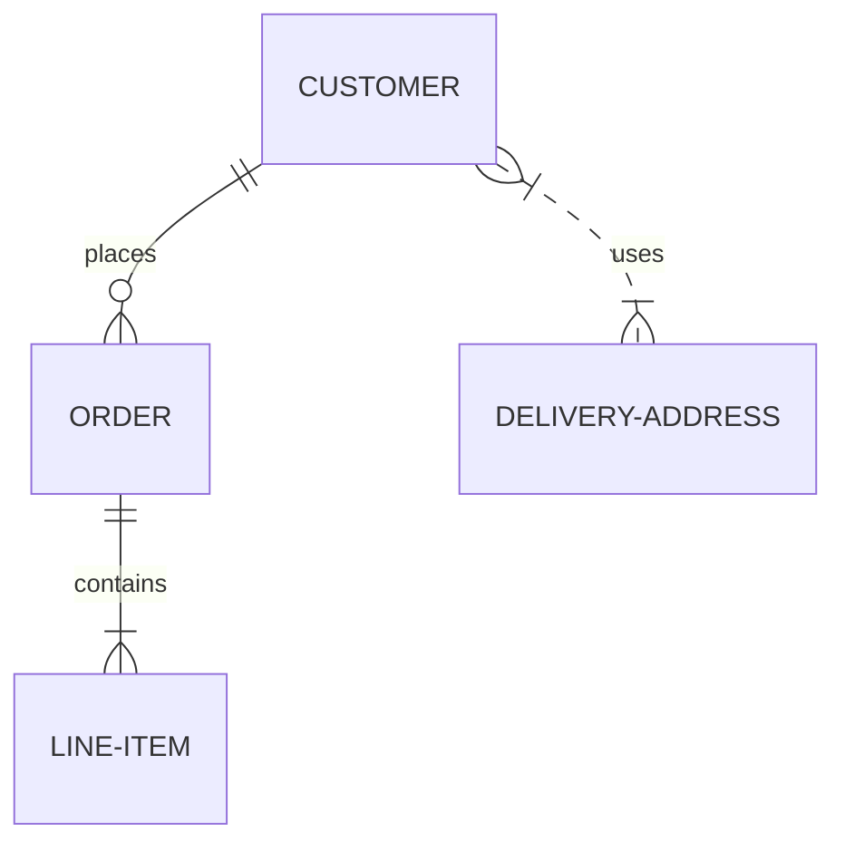
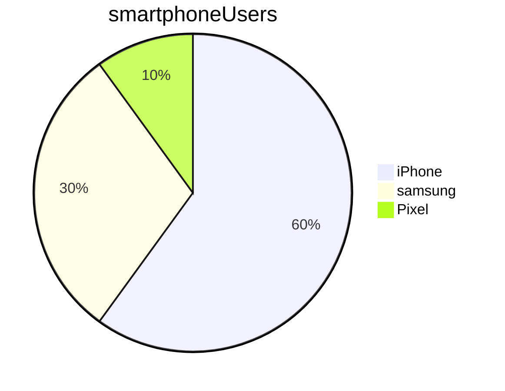

This is plain text

# Header 1

## Header 2

### Header 3

###### Header 6

*This is italic text*

_underscores are also italic_

**This is bold**

> I hate how much the Switch 2 costs, they're robbers
> 
> This is going to be the WiiU again
> > You don't know waht you're talking about
> > > This is more nested


- This
- That 
  - Nested
- The other
*  Stars work too!
  
1. One
2. Two
3. Three
   1. Three point 1

If you want to know more about HTD visit the [Sparta Global](https://www.spartaglobal.com/) website

<!-- 

 -->


- [Intro to Java](#header-1)

So far we have looked the the `Integer` class

```SQL
SELECT * FROM Customers
```

Let's consider the code below?
```java
public static void main(){
    System.out.printlun("Hello, World");
}
```

It won't compule beecause tehre is not method called `printlun`


- [ ] Sleep
- [x] Teach

Name | Course | City
----|---------|-----
Nish|Java     | St Neots
Cathy| Java | Stafford




